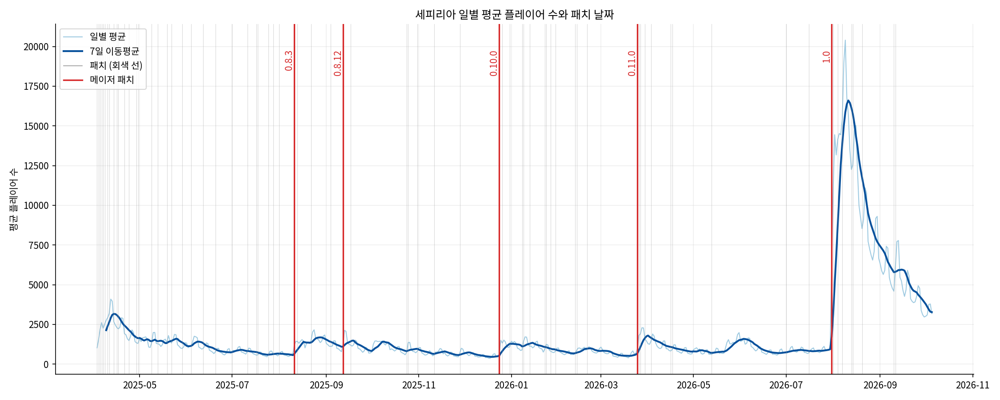
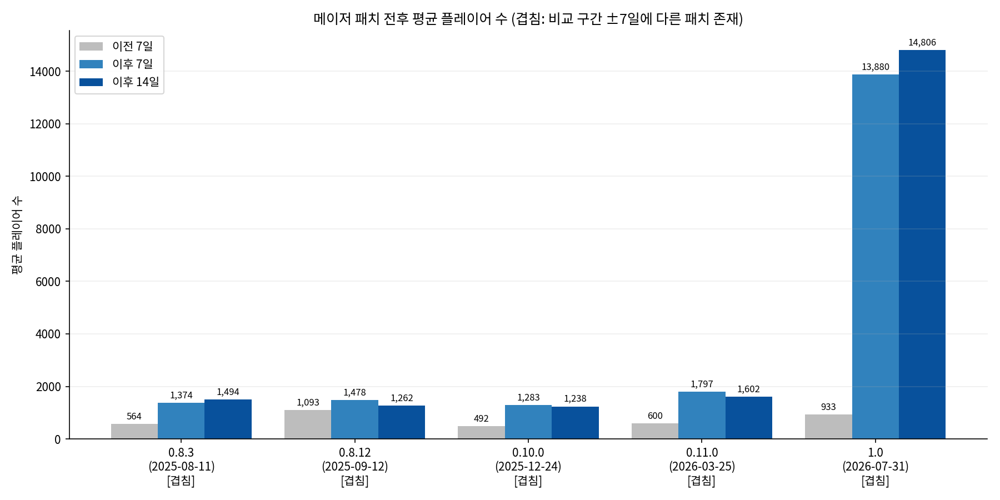
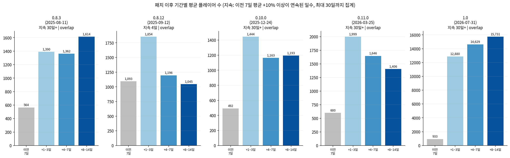
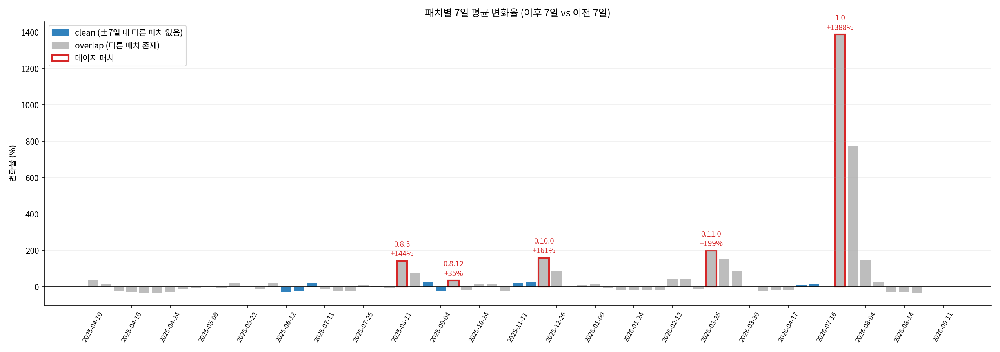
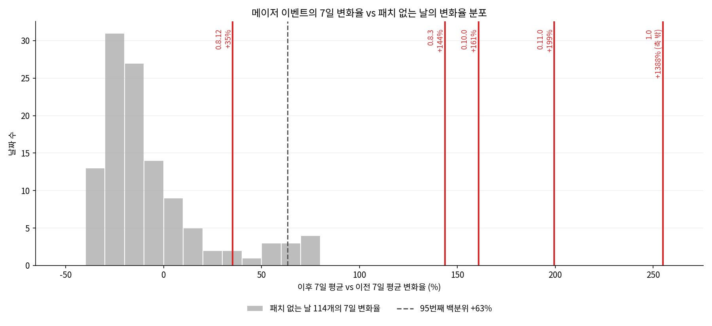
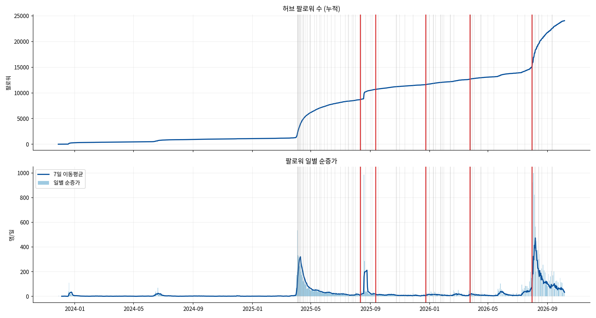

# 세피리아 패치 전후 플레이어 수 변화 분석 리포트

## 1. 분석 주제 및 선정 이유

- **주제**: Steam 게임 *Sephiria*의 패치 날짜를 기준으로, 패치 전후 일별 평균 플레이어 수가 어떻게 달라졌는지 분석한다.
- **선정 이유**: 패치는 게임이 플레이어에게 직접 전달하는 변화이고, 패치 날짜는 명확한 기준점이다. 시계열의 "꺾이는 지점"과 패치 날짜를 맞춰 보면 "그래서 이게 무슨 의미인가"를 숫자로 따져 볼 수 있다.
- **분석 흐름**: 패치가 얼마나 영향을 받았나 → 그 변화가 얼마나 오래 갔나 → 패치마다 반응이 달랐나
- 이 분석은 **상관·관찰**만 다룬다. "패치 때문에 플레이어가 늘었다"는 인과는 단정하지 않는다.

## 2. 분석 질문

1. **변화량**: 패치 전후로 일별 평균 플레이어 수가 얼마나 변했는가?
2. **지속성**: 패치 이후 증가한 플레이어 수가 얼마나 오래 유지되었는가? 단기 반응인가, 지속적인 변화인가?
3. **패치별 반응 차이**: 모든 패치가 같은 정도의 반응을 보였는가? 어떤 패치에서 변화가 가장 크게 관찰되었는가?

## 3. 데이터 설명

| 항목 | 내용 |
|---|---|
| 플레이어 수 출처 | SteamDB 차트 CSV (`data/steamdb_chart_Sephira_Max.csv`), 앱 ID 2436940 |
| 패치 목록 출처 | SteamDB 패치노트 목록 (`data/sephiria_patchnotes.csv`) |
| 분석 기간 | 2025-04-03 ~ 2026-10-05 |
| 데이터 포인트 | **551일** (일별 평균 플레이어 수) |
| 패치 | 원본 127건 → 같은 날짜 묶음 **73개 패치일** (이 중 5개가 SteamDB의 MAJOR 표시) |
| 사용 컬럼 | `Average Players` (자정 행의 값을 일별 평균으로 사용) |
| 보강 데이터 | SteamDB 허브 팔로워 CSV (`data/steamdb_chart_HubFollowers.csv`), 2023-11-28 ~ 2026-10-06, 1,044일. 누적 팔로워의 전일 차이를 **일별 순증가**로 사용 |

### 데이터 점검과 처리 기준

- **팔로워 데이터**: 결측 0, 날짜 간격 1일. 일별 순증가가 음수인 날 13일(최소 -1)은 그대로 두었다. 마지막 며칠은 값이 이틀씩 같아(예: 10-02/03, 10-04/05) 갱신 지연으로 보이며 패치 분석 구간 밖이다.

- **누락·중복·결측**: 분석 기간 내 누락일 0, 중복일 0, 결측 0, 0 이하 값 0.
- **원본 구조**: 원본 CSV는 일 단위 행, 최근 며칠은 1시간·10분 단위 행이 섞여 있다. 자정(00:00) 행만 일별 값으로 사용했다.
- **마지막 날 제외**: 2026-10-06은 하루가 끝나지 않은 값이라 제외했다.
- **이상치**: 롤링 중앙값(28일) 기준 robust z-score가 3.5를 넘는 날을 `data/outliers.csv`에 **기록만** 하고 제거하지 않았다 (6일, 아래 표). 제거하면 패치 직후의 급증이 사라지므로 분석 목적과 충돌한다.
- **같은 날 여러 패치**: 하루 단위 시계열이라 날짜 하나로 묶었다. 같은 날 패치 효과는 분리할 수 없다.
- **패치 당일 제외**: 패치 시각이 하루 중 일부이므로 당일은 이전/이후 구간에서 뺐다.
- **집계 단위 선택 이유**: SteamDB가 제공하는 일 단위가 가장 세밀하고, 비교 구간을 7일로 잡아 요일 주기를 한 번씩 포함시켰다.

| 이상치 후보 날짜 | 일 평균 | 28일 롤링 중앙값 | robust z |
|---|---:|---:|---:|
| 2025-04-12 | 4,091 | 2,315 | 3.9 |
| 2026-03-28 | 2,288 | 1,028 | 4.3 |
| 2026-03-29 | 2,278 | 1,079 | 4.0 |
| 2026-07-31 | 6,255 | 3,685 | 10.2 |
| 2026-08-01 | 11,032 | 8,644 | 9.5 |
| 2026-08-02 | 14,442 | 11,644 | 4.0 |

6일 모두 어떤 패치일로부터 4일 이내에 있다. 다만 패치일이 73개로 촘촘해서 우연히 겹칠 가능성도 크다. 원인은 이 데이터만으로 판단하지 않는다.

## 4. 분석 방법

| 기법 | 적용 |
|---|---|
| 이동평균 | 7일 이동평균으로 일별 노이즈 완화 (그래프 1) |
| 변화율 | `(패치 후 7일 평균 − 패치 전 7일 평균) / 패치 전 7일 평균 × 100` |
| 구간별 통계 | 패치 후 1~3일, 4~7일, 8~14일 평균을 패치 전 7일 평균과 비교 |
| 이상치 탐색 | 롤링 중앙값 + MAD 기반 robust z-score |
| 이벤트 묶기 | 패치일 간격이 7일 이내로 이어지면 하나의 이벤트로 묶음 (73개 패치일 → 24개 이벤트). 이벤트 시작일을 기준으로 전후 7일 비교 |
| 플라시보 비교 | 패치가 ±7일 안에 없는 날 114개를 가짜 패치일로 두고 같은 7일 변화율을 계산해 기준 분포를 만들고, 각 이벤트가 그 분포의 몇 번째 백분위인지 계산 |
| 팔로워 | 같은 전후 7일 방식으로 일별 순증가의 평균 차이를 계산하고 같은 플라시보 분포와 비교 |

**겹침(overlap) 판정**: 패치일 단위에서는 비교 구간(패치 ±7일)에 다른 패치일이 있으면 `overlap`, 없으면 `clean`이다. 변화율이 계산된 67개 중 `clean`은 **10개**, `overlap`은 **57개**다. 메이저 5개는 모두 `overlap`이다.

**이벤트 단위 겹침**: 이벤트 시작 −7일 ~ +14일에 다른 이벤트가 걸치면 overlap이다. 이벤트로 묶으면 변화율이 계산된 23개 중 **17개가 clean**이다 (패치일 단위는 10 / 67).

**지속일**: 패치 다음 날부터 일 평균이 패치 전 7일 평균의 +10% 이상을 연속으로 유지한 일수 (최대 30일까지만 집계).

## 5. 시각화

### 그래프 1. 일별 평균과 7일 이동평균, 패치 날짜

회색선은 모든 패치일, 빨간선은 메이저 패치다. 얼리 액세스 시작(2025-04) 직후 한 번 올랐다가 완만히 내려가는 흐름이 있고, 메이저 패치 근처마다 7일 이동평균이 올라간 모양이 보인다. 2026-07-31 이후의 급등은 다른 구간과 규모 차이가 매우 커서 같은 축에서는 나머지 변화가 작게 보인다.

### 그래프 2. 메이저 패치 전후 평균

메이저 5개 모두 이후 7일·14일 평균이 이전 7일보다 높다. 1.0 패치의 값(13,880)이 나머지 4개의 최대값(1,797)보다 7배 이상 커서 막대 길이 비교만으로는 나머지 4개의 차이를 읽기 어렵다. 수치는 아래 표를 본다.

### 그래프 3. 패치 이후 기간별 평균

패치 후 구간별 평균이 이전 7일 평균보다 계속 높게 유지되는지 본다. 0.8.12만 8~14일 구간에서 이전 수준 아래로 내려간다.

### 그래프 4. 패치별 7일 변화율

파란색은 clean, 회색은 overlap, 빨간 테두리는 메이저 패치다. 큰 양의 변화율은 메이저 패치와 그 직후 패치에 몰려 있다.

### 그래프 5. 플라시보 비교

회색 막대는 패치가 없는 날 114개의 7일 변화율, 빨간선은 메이저 이벤트다. 0.8.3, 0.10.0, 0.11.0, 1.0은 분포 오른쪽 끝(최댓값 +77%)보다 훨씬 오른쪽에 있고, 0.8.12(+35%)는 분포 안에 있다. 1.0(+1,388%)은 축 밖이라 가장자리에 표시했다.

### 그래프 6. 팔로워 누적과 일별 순증가

2025-04 (얼리 액세스 시작)과 2026-07-31 (1.0) 이후에 일별 순증가가 크게 올라간다. 2025-08-19에는 하루 +987명 급증이 있는데 패치일(0.8.3은 08-11, 0.8.8은 08-22)과 일치하지 않는다.

## 6. 인사이트

### 인사이트 1. 변화량: 메이저 패치 5개 모두 이후 7일 평균이 이전보다 높았다

**관찰 (Fact)**

| 패치 | 날짜 | 이전 7일 평균 | 이후 7일 평균 | 변화율 | 이후 14일 vs 이전 14일 |
|---|---|---:|---:|---:|---:|
| 0.8.3 (Chapter 3) | 2025-08-11 | 564 | 1,374 | **+144%** | +146% |
| 0.8.12 | 2025-09-12 | 1,093 | 1,478 | **+35%** | +1% |
| 0.10.0 (Chapter 4) | 2025-12-24 | 492 | 1,283 | **+161%** | +154% |
| 0.11.0 | 2026-03-25 | 600 | 1,797 | **+199%** | +184% |
| 1.0 | 2026-07-31 | 933 | 13,880 | **+1,388%** | +1,567% |

- 메이저 5개의 변화율 중앙값은 +161%, 메이저가 아닌 패치(62개)의 중앙값은 -3.2%였다.

**보강: 플라시보 비교 (우연한 변동과 구분되는가)**
- 패치가 ±7일 안에 없는 날 114개의 7일 변화율은 평균 −6.9%, 중앙값 −17.8%, 95번째 백분위 +63%, 최댓값 +77%였다. 패치 사이에는 완만히 줄어드는 경향이 있다.
- 0.8.3(+144%), 0.10.0(+161%), 0.11.0(+199%), 1.0(+1,388%)은 이 분포의 최댓값보다 컸다. **0.8.12(+35%)는 89.5 백분위로 우연한 변동과 구분되지 않는다.**
- 이벤트 23개 중 95번째 백분위(+63%)를 넘은 것은 위 4개뿐이다. 메이저가 아닌 18개의 변화율은 −28% ~ +44%(중앙값 +4.5%)였다.
- 팔로워 일별 순증가(이전 7일 → 이후 7일, 명/일): 0.8.3 10.4 → 22.0, 0.10.0 5.1 → 15.4, 0.11.0 13.7 → 15.7, 1.0 70.9 → 473.1, 0.8.12 17.9 → 14.9. 팔로워 증가폭의 백분위는 각각 96.5, 96.3, 90.4, 100, 12.3이다.

**해석 (Why, 가설)**
- 플레이어 수와 팔로워가 같이 늘어난 4개와, 둘 다 늘지 않은 0.8.12가 갈린다. 신규 유입이 있었던 패치와 아닌 패치가 구분된다는 가설과 일치한다. 다만 두 지표 모두 같은 관심 증가에 반응하는 값이라 독립된 증거로는 약하다.
- 제목에 챕터가 붙은 0.8.3, 0.10.0 패치에서 변화가 컸다. 새 콘텐츠 추가가 플레이어 복귀·유입과 이어졌을 가능성이 있다.
- 1.0은 정식 출시 패치(2026-07-31)이고, 가장 크게 뛴 패치일이 곧 정식 출시일이다. 일반 업데이트와 같은 선상에서 비교하기 어렵고, 패치 내용과 출시 자체의 효과를 분리할 수 없다.
- **반례/한계**: 5개 모두 비교 구간에 다른 패치가 1~3개 있다(overlap). 0.8.12는 이전 7일(1,093)이 0.8.3 직후의 높은 수준을 이어받은 값이라 변화율이 작게 계산됐을 수 있다.

**행동 (Action)**: 세일·스트리머 노출 등 외부 이벤트 기록을 같은 기간에 붙여 보고, `clean` 구간만으로 다시 비교한다.

### 인사이트 2. 지속성: 4개는 2주 뒤에도 높은 수준이 유지됐고, 0.8.12만 단기 반응이었다

**관찰 (Fact)** (패치 전 7일 평균 대비 변화율)

| 패치 | +1~3일 | +4~7일 | +8~14일 | 이전 7일 +10% 이상 유지 |
|---|---:|---:|---:|---:|
| 0.8.3 | +146% | +141% | +186% | 30일 이상 |
| 0.8.12 | +70% | +9% | **−4%** | **4일** |
| 0.10.0 | +194% | +136% | +143% | 30일 이상 |
| 0.11.0 | +233% | +174% | +134% | 30일 이상 |
| 1.0 | +1,281% | +1,469% | +1,587% | 30일 이상 |

- 0.11.0은 직후 +233%에서 2주 차 +134%로 줄었다. 0.8.12는 2주 차에 전 수준으로 돌아갔다.
- 1.0은 일 평균이 2026-08-09에 최고 20,399를 기록했고, 2026-10-05에는 3,180이다. 최고점에서는 크게 내려왔지만 패치 전 7일 평균(933)의 약 3.4배다.
- 지속일은 최대 30일까지만 집계해서 4개 패치가 상한에 걸렸다. 실제 지속 기간은 이보다 길 수 있다.

**해석 (Why, 가설)**
- 0.8.12는 이전 7일이 이미 높은 상태에서 시작했고(1,093), 이후 수준으로 되돌아간 것일 수 있다. 직전 메이저(0.8.3)의 영향이 줄어드는 과정과 겹쳤을 가능성이 있다.
- 0.11.0은 초기 반응이 컸다가 서서히 줄었으므로, 신규 콘텐츠를 소화한 플레이어가 빠지는 흐름과 일치한다.

**행동 (Action)**: 지속 판정 기준(+10%)과 상한(30일)을 바꿔 결과가 유지되는지 민감도를 확인한다.

### 인사이트 3. 패치별 반응 차이: 변화율은 −31%에서 +1,388%까지 넓게 퍼졌고, 큰 변화는 메이저 패치와 그 직후 패치에 몰렸다

**관찰 (Fact)**
- 변화율이 계산된 67개 패치의 범위는 **−31.4% ~ +1,388%**, 중앙값은 −1.1%다.
- 메이저가 아닌 62개 중 +10%를 넘은 패치는 23개, −10% 아래는 26개, 나머지 13개는 ±10% 안이었다.
- 변화율 상위 10개 중 메이저가 아닌 패치는 1.0.22(+776%, 2026-08-01), 0.11.x 무제목(+155%, 03-26), 1.0.23(+144%, 08-04), 0.11.3(+89%, 03-27), 0.10.4(+85%, 12-26), 0.8.7(+74%, 08-13)이다. **모두 메이저 패치 하루~며칠 뒤**에 있다.
- `clean`으로 분류된 10개 패치의 변화율은 **−28% ~ +27%** 범위였다.
- 가장 큰 감소는 0.7.25 & 26 (2025-04-21, −31.4%)로, 얼리 액세스 시작(2025-04-03) 약 2~3주 뒤다.

**보강: 이벤트로 묶어 다시 비교**
- 7일 이내로 이어진 패치를 하나로 묶으면 73개 패치일이 24개 이벤트가 되고, 변화율이 계산되는 23개 중 17개가 clean이다. 후속 핫픽스가 같은 이벤트 안에 들어가므로 "후속 패치가 효과가 컸다"는 착시가 사라진다.
- 플레이어 수와 팔로워 증가가 **둘 다 플라시보 상위 10%(백분위 90 이상)**였던 이벤트는 0.8.3, 0.10.0, 0.11.0, 1.0과 비메이저인 **0.10.15 (2026-02-12, 플레이어 +43.6%, 백분위 91.2 / 팔로워 95.8)** 다섯 개였다.
- 0.12.4(2026-07-16)는 플레이어 변화는 거의 없지만(−0.1%) 팔로워 증가가 상위 5%(95.4)였다. 이 이벤트는 1.0 출시 2주 전이다.
- 0.8.8의 팔로워 변화(−164명/일, 백분위 0)는 패치 전 7일에 낀 2025-08-19의 하루 +987명 급증 때문이며 패치 효과로 읽을 수 없다.

**해석 (Why, 가설)**
- 메이저 직후 패치의 높은 변화율은 그 패치 자체보다 **직전 메이저의 효과가 비교 구간에 걸쳐 있어서** 생긴 값일 가능성이 크다. 같은 이유로 후속 패치를 "효과가 컸다"고 읽으면 안 된다.
- `clean` 패치에서는 큰 변화가 관찰되지 않았다. 일반 업데이트·핫픽스는 플레이어 수와 눈에 띄게 연결되지 않았을 가능성이 있다. 다만 clean 표본이 10개뿐이라 단정하기 어렵다.
- 2025-04의 감소는 출시 직후 관심이 줄어드는 흐름일 수 있지만, 이 데이터만으로는 확인할 수 없다.

**행동 (Action)**: 0.10.15의 패치노트 내용을 확인해 비메이저인데 반응이 컸던 이유를 본다. 이벤트 표(`data/event_analysis.csv`)와 패치 표(`data/patch_analysis.csv`)는 다음 단계의 AI 비서에서 "어떤 패치가 가장 효과가 컸어?" 같은 질문의 근거 데이터로 쓸 수 있다.

## 7. 결론 및 한계점

### 결론
- 메이저 패치 5개 모두에서 이후 7일 평균 플레이어 수가 이전보다 높게 관찰되었다 (+35% ~ +1,388%).
- 5개 중 4개는 2주 후에도 높은 수준이 유지되었고, 1개(0.8.12)는 2주 안에 이전 수준으로 돌아왔다.
- 패치마다 반응 차이가 컸다. 이벤트 단위로 묶고 패치 없는 날과 비교하면, 우연한 변동 범위를 넘은 것은 메이저 4개(0.8.3, 0.10.0, 0.11.0, 1.0)였고 0.8.12는 구분되지 않았다. 팔로워도 같은 방향이었다.

### 한계점
- **인과 단정 불가**: 세일, 스트리머 노출 등 외부 변수를 반영하지 않았다. 1.0은 정식 출시와 같은 날이라 패치 내용과 출시 효과를 분리할 수 없다.
- **패치가 너무 촘촘함**: 패치일 단위로는 67개 중 57개가 overlap이다. 이벤트로 묶어 완화했지만(23개 중 6개 overlap), 묶은 이벤트 안의 개별 패치 효과는 분리할 수 없다. 첫 이벤트(2025-04-03 얼리 액세스 시작, 패치 15일 연속)는 이전 구간이 없어 제외했다.
- **플라시보 기준의 한계**: 패치 없는 날은 114일뿐이고 대부분 관심이 줄어드는 구간이라 기준선이 낮게(평균 −6.9%) 잡혔을 수 있다. 가짜 패치일이 우연히 다른 이벤트의 여운 위에 있을 수도 있다.
- **팔로워 지표**: 패치와 무관해 보이는 급증(2025-08-19, +987명)이 있고 원인은 이 데이터로 알 수 없다. 플레이어 수와 독립된 증거도 아니다.
- **메이저 구분이 SteamDB 표시에 의존**: 메이저 여부는 SteamDB가 붙인 표시를 그대로 썼고 내용 기준으로 검증하지 않았다.
- **`Average Players` 정의**: 원본 열이 정확히 UTC 달력 하루 평균인지는 SteamDB 문서로 확인하지 못했다. 날짜가 하루 어긋나면 당일 제외 규칙에 영향을 줄 수 있다.
- **표본 크기와 기간**: clean 패치가 10개, 데이터는 약 18개월이다. 계절성(분해) 분석과 예측은 하지 않았다.
- **1.0의 규모**: 1.0 패치가 다른 값보다 매우 커서 평균·중앙값 같은 요약 통계가 한쪽으로 끌릴 수 있다.

## 8. AI 사용 로그

| 사용 작업 | 사용 이유 | 검증 방법 |
|---|---|---|
| 분석 설계 (전후 7/14일 비교, 구간 나누기, clean/overlap 판정) | 대안 탐색, 시간 절감 | 모든 패치에 같은 기준을 적용했는지 코드로 확인 |
| 전처리·분석·시각화 코드 초안 작성 | 시간 절감 | 원본 CSV 구조(일/시간/10분 행 혼재)를 직접 확인한 뒤 자정 행만 쓰도록 수정, 점검 함수 출력(누락·중복·결측 0) 확인 |
| 그래프 생성과 수정 | 시간 절감 | 생성된 이미지를 눈으로 확인하고, 한글 폰트 깨짐과 범례 색 오류를 찾아 수정 후 재생성 |
| 보강 분석 설계 (이벤트 묶기, 플라시보 비교, 팔로워 추가)와 코드 | 약점 보완 방법 탐색 | 이벤트 24개의 시작·종료일과 패치 수를 출력해 패치 목록과 대조, 플라시보 후보 일수(114)와 분포 그래프 확인, 팔로워 급증일(2025-08-19)을 원본에서 직접 조회 |
| 인사이트 문장 정리 | 문장 다듬기 | 리포트 수치를 `data/patch_analysis.csv` 출력에서 옮기고, 관찰(Fact)과 해석(가설)을 분리해 서술 |

- [ ] 제출 전 직접 검증: 임의의 패치 2~3개를 `data/cleaned_data.csv`에서 스프레드시트로 직접 계산해 `patch_analysis.csv` 값과 일치하는지 확인
- 코드를 다시 실행하면 같은 CSV와 그래프가 재생성된다 (`python sephiria_analysis.py`).
- 인과 표현, 해석(가설), 결론의 최종 판단은 본인이 근거를 들어 설명한다.

## 9. 재현 방법과 데이터 출처

- Python 3.10 이상, `pip install -r requirements.txt`, `python sephiria_analysis.py` (자세한 내용은 [README.md](README.md))
- 데이터: SteamDB 차트·패치노트. 사용 조건은 SteamDB 약관을 따르며, 사본은 학습·분석 목적으로만 포함했다.
